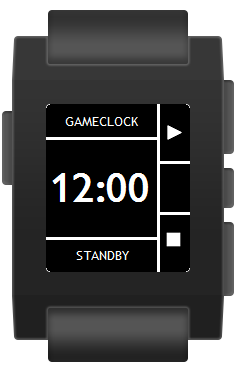
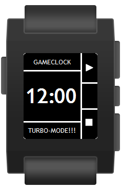
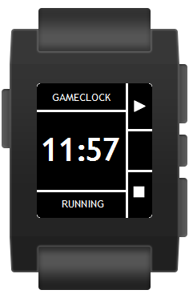
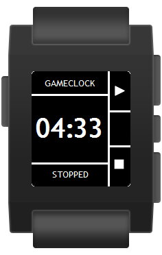
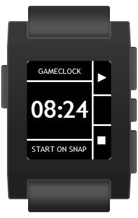
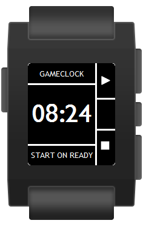
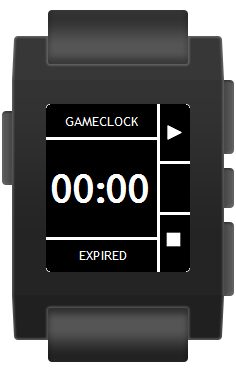
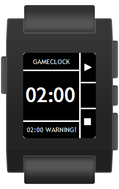

# GameClock
by Michael Krenn, American Football official in Austria.

Clock for American Football officials working as on-field timekeeper based on the NCAA Rules 2016.

With this watchapp it is possible to operate the gameclock on the field without taking a look at the watch too often and missing action. It works offline although most of the settings like notifications and vibration patterns are customizable via phone when connected.

Pressing the up- / down-button starts / stops the timer, giving a vibration signal as confirmation.
Pressing one of these buttons long allows to increase or decrease the time (e.g. 10 second run-off), which is only possible when the timer is stopped.
Pressing the select-button long resets the timer to initial time and activates standby-mode, which allows to enable / disable vibration using the select-button again or increase / decrease initial time (length of a period).

There are special notifications for the 2 minute warning and the expiry of the timer: a countdown before one of these events occur can be configured.
9 notifications can be configured individually.
Per default the gameclock sends a vibration signal when timer reaches 5:00, 4:00, 3:00, 2:30, 2:00, 1:00 and, of course, when the timer expires.

It is also possible to set a marker on a stopped timer wheather it has to be started on ready or on snap.

For test purposes a tubo-mode can be activated which decreases the timer by 5 every second.

## How it works
The back-button (the one on the left side) always closes the GameClock watchapp, so be careful not pressing it accidentally!

The timer can have the following states:

### STANDBY (start screen)

#### UP-Button (*2x short vibes*)
Starts the countdown (new state: *RUNNING*)
#### UP-Button pressed long
Adds one minute to the length of a period without connecting to the phone.
#### SELECT-Button
Vibration signals can be enabled / disabled immediately without connecting to the phone.
#### SELECT-Button pressed long
Enabled "Turbo-Mode" (for test purposes the timer 5 times faster)

#### DOWN-Button
Disabled - no action
#### DOWN-Button pressed long
Substracts one minute from the length of a period without connecting to the phone.

### RUNNING

When the clock is running all buttons are disabled except:
#### DOWN-Button (*1x short vibe*)
Stops the countdown (new state: *STOPPED*)

### STOPPED

#### UP-Button (*2x short vibes*)
Starts the countdown (new state: *RUNNING*)
#### UP-Button pressed long
Increases the timer by 3 seconds (configurable on the phone).
#### SELECT-Button
Switches between message "START ON SNAP" (*1x short vibe*) and "START ON READY" (*2x short vibes*)

 
#### SELECT-Button pressed long
Resets the timer (new state: *STANDBY*)
#### DOWN-Button
Disabled - no action
#### DOWN-Button pressed long
Decreases the timer by 10 seconds (configurable on the phone), e.g. for a 10 second run-off.

### EXPIRED

When the timer has expired all buttons are disabled except:
#### SELECT-Button
Resets the timer (new state: *STANDBY*)

## Notifications
There are special notifications for the 2 minute warning and the expiry of the timer: a countdown before one of these events occur can be configured (default: 5 seconds).

Up to 9 individual notifications can be configured via smartphone which display appropriate messages and send vibration signals (similar to the 2 minute warning). The following notifications are set by default:

* 05:00 WARNING! (*5x long vibes*)
* 04:00 WARNING! (*4x long vibes*)
* 03:00 WARNING! (*3x long vibes*)
* 02:30 WARNING! (*2x long, 1x short vibes*)
* 01:00 WARNING! (*1x long vibe*)

## Settings
On the smartphone the vibration patterns, notifications and other features of the GameClock can be configured very easily. Note that there is only communication from the smartphone to the Pebble watch implemented, not the other way! So enabling / disabling the vibration (SELECT-Button pressed in standby mode) or changing the length of a period on the Pebble is overwritten when the settings on the smartphone are saved the next time (while connected to the Pebble watch, of course).

***

# GameClock
von Michael Krenn, American Football Schiedsrichter in Österreich.

Uhr für American Football Schiedsrichter, die am Feld für die GameClock verantwortlich sind, basierend auf den NCAA Rules 2016.

Mit dieser Watchapp ist es möglich, die GameClock am Feld zu betreiben, ohne zu oft auf die Uhr zu sehen und Vorgänge am Spielfeld zu verpassen.
Die Uhr funktioniert ohne Verbindung zum Handy, trotzdem die meisten Einstellungen wie Benachrichtigungen und Vibrationsmuster via Handy veränderbar sind, wenn eine Verbindung besteht.

Den oberen / unteren Knopf zu drücken startet / stoppt die Uhr und sendet ein Vibrationssignal als Bestätigung.
Drückt man einen dieser Knöpfe länger, kann man die Zeit nach oben oder unten korrigieren (z.B. 10 second run-off), was nur möglich ist, wenn die Uhr gestoppt ist.
Das längere Drücken des mittleren Knopfes setzt die Uhr auf die Startzeit zurück und aktiviert den Standby-Modus, in welchem die Vibration durch erneutes Drücken dieses Knopfes ein- und ausgeschaltet oder die Startzeit erhöht / verringert werden kann (Länge eines Viertels). 

Für die 2-Minuten-Warnung und das Auslaufen der Uhr gibt es spezielle Benachrichtigungen: es kann ein Countdown für jedes dieser Ereignisse konfiguriert werden.
9 Benachrichtigungen können individuell eingestellt werden.
Standardmäßig sendet die GameClock ein Vibrationssignal, wenn die folgenden Zeiten erreicht sind: 5:00, 4:00, 3:00, 2:30, 2:00, 1:00 und natürlich, wenn die Uhr ausgelaufen ist.

Des weiteren ist es möglich, sich ein Kennzeichen zu setzen, ob die Uhr "on ready" oder "on snap" zu starten ist.

Zu Testzwecken kann ein Turbo-Modus aktiviert werden, der jede Sekunde 5 Sekunden von der Uhr nimmt.

## Wie funktionierts?
Der Zurück-Knopf (jener auf der linken Seite) schließt immer die GameClock Watchapp, daher ist Vorsicht geboten, ihn nicht unabsichtlich zu drücken.

Die Uhr kann folgende Zustände haben:

### STANDBY (Start-Ansicht)

#### Knopf oben (*2x kurze Vibration*)
Startet die Uhr (neuer Zustand: *RUNNING*)
#### Knopf oben lang gedrückt
Erhöht die Dauer eines Viertels um eine Minute ohne Verbindung zum Handy.
#### Knopf in der Mitte
Vibrationssignale können sofort ein- / ausgeschaltet werden, ohne mit dem Handy verbunden sein zu müssen.
#### Knopf in der Mitte lang gedrückt
Aktiviert den "Turbo-Modus" (für Testzwecke läuft die Uhr in 5-facher Geschwindigkeit)

#### Knopf unten
Deaktiviert - kein Ereignis
#### Knopf unten lang gedrückt
Verringert die Dauer eines Viertels um eine Minute ohne Verbindung zum Handy.

### RUNNING

Wenn die Uhr läuft, sind alle Knöpfe deaktiviert außer:
#### Knopf unten (*1x kurze Vibration*)
Stoppt die Uhr (neuer Zustand: *STOPPED*)

### STOPPED

#### Knopf oben (*2x kurze Vibrationen*)
Startet die Uhr (neuer Zustand: *RUNNING*)
#### Knopf oben lange gedrückt
Erhöht die Zeit auf der Uhr um 3 Sekunden (am Handy konfigurierbar).
#### Knopf in der Mitte
Wechselt zwischen den Nachrichten "START ON SNAP" (*1x kurze Vibration*) and "START ON READY" (*2x kurze Vibrationen*)

 
#### Knopf in der Mitte lange gedrückt
Setzt die Uhr zurück (neuer Zustand: *STANDBY*)
#### Knopf unten
Deaktiviert - kein Ereignis
#### Knopf unten lange gedrückt
Verringert die Zeit auf der Uhr um 10 Sekunden (am Handy konfigurierbar)., z.B. für einen 10 second run-off.

### EXPIRED

Wenn die Uhr ausgelaufen ist, sind alle Knöpfe deaktiviert außer:
#### Knopf in der Mitte
Setzt die Uhr zurück (neuer Zustand: *STANDBY*)

## Benachrichtigungen
Es gibt spezielle Benachrichtigungen für die 2-Minuten-Warung und das Auslaufen der Uhr: für diese kann ein Countdown konfiguriert werden (Standard: 5 Sekunden).

Bis zu 9 individuelle Benachrichtigungen können am Handy konfiguriert werden, die entsprechende Nachrichten anzeigen und Vibrationssignale senden (ähnlich der 2-Minuten-Warnung). Die folgenden Benachrichtigungen sind standardmäßig gesetzt:

* 05:00 WARNING! (*5x lange Vibrationen*)
* 04:00 WARNING! (*4x lange Vibrationen*)
* 03:00 WARNING! (*3x lange Vibrationen*)
* 02:30 WARNING! (*2x lange Vibrationen, 1x kurze Vibration*)
* 01:00 WARNING! (*1x lange Vibration*)

## Settings
Am Handy können die Vibrationsmuster, Benachrichtigungen und andere Funktionen der GameClock sehr einfach konfiguriert werden. Beachten Sie, dass nur Kommunikation vom Handy zur Pebble-Uhr eingerichtet ist, nicht anders herum! Somit wird die Aktivierung / Deaktivierung der Vibration (Knopf in der Mitte wird im Standby-Modus gedrückt) oder das Verändern der Viertellänge auf der Pebble überschrieben, sobald die Einstellungen am Handy das nächste mal gespeichert werden (und mit der Pebble-Uhr verbunden ist).
